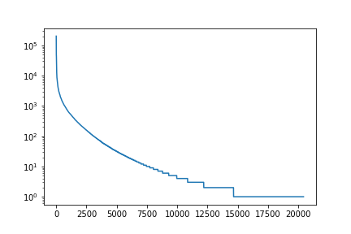

# Use ElasticSearch term vectors API to retrieve and store for each document the following data:
1. The terms (tokens) that are present in the document.
2. The number of times given term is present in the document.

define index
```
PUT /lab3_index
{
    "settings": {
        "analysis": {
            "analyzer": {
                "lab3_analyzer": {
                    "type": "custom",
                    "tokenizer": "standard",
                    "filter": [
                        "lowercase",
                        "synonym_filter",
                        "morfologik_stem"
                    ]
                }
            },
            "filter": {
                "synonym_filter": {
                    "type": "synonym",
                    "synonyms": [
                        "kpk=>kodeks postępowania karnego",
                        "kpc=>kodeks postępowania cywilnego",
                        "kk=>kodeks karny",
                        "kc=>kodeks cywilny"
                    ]
                }
            }
        }
    },
    "mappings": {
        "act": {
            "properties": {
                "content": {
                    "type": "text",
                    "term_vector": "with_positions_offsets_payloads",
                    "store" : true,
                    "analyzer": "lab3_analyzer"
                }
            }
        }
    }
}
'
```

upload files
```
import os
import requests

def filesNames():
    path = '../ustawy'
    absolute_path = os.path.realpath(path) + "\\"
    return [(absolute_path + filename, filename) for filename in os.listdir(path)]

def getFileTextRaw(filename):
    with open(filename, 'r', encoding="utf8") as content_file:
        return content_file.read()
    
def getIndexFromFilename(filename):
    return filename.replace('.txt', '')

def sendData(filename, content):
    name = getIndexFromFilename(filename)
    url = 'http://localhost:9200/lab3_index/act/{}'.format(name)
    headers = {'Content-Type': 'application/json'}
    data = {'content': content}
    requests.put(url=url, json=data, headers=headers)
    
def sendAllData():
    for (path, filename) in filesNames():
        content = getFileTextRaw(path)
        sendData(filename, content)

sendAllData()
```

get data for file
```
PUT /lab3_index/act/1993_599/_termvectors
```

# Aggregate the result to obtain one global frequency list.

```
from collections import Counter
from operator import add
import functools

def getTerms(filename):
    name = getIndexFromFilename(filename)
    url = 'http://localhost:9200/lab3_index/act/{}/_termvectors'.format(name)
    r = requests.get(url=url)
    terms =  r.json()['term_vectors']['content']['terms']
    mapTerms = {k: v['term_freq'] for (k,v) in terms.items()}
    return mapTerms

def aggregateTerms(terms):
    return functools.reduce(add, (Counter(dict(x)) for x in terms))
    
def getAllAggregateTerms():
    terms = [getTerms(filename) for (path, filename) in filesNames()]
    return aggregateTerms(terms)
aggregate_terms = getAllAggregateTerms()
```

# Filter the list to keep terms that contain only letters and have at least 2 of them

```
def filterTerms(terms):
    return {x: terms[x] for x in terms if x.isalpha() and len(x) > 1}
filter_aggregate_terms = filterTerms(aggregate_terms)
```

# Make a plot in a logarithmic scale:
1. X-axis should contain the **rank** of a term, meaning the first rank belongs to the term with the highest number of occurrences; the terms with the same number of occurrences should be ordered by their name,
2. Y-axis should contain the **number of occurrences** of the term with given rank.

```
def orderTerms(terms):
    listTerm = [(k,terms[k]) for k in terms]
    listTerm.sort(key = lambda x: (-x[1],x[0]))
    return listTerm

order_terms = orderTerms(filter_aggregate_terms)

import matplotlib.pyplot as plt

def plotValues(values):
    fig, ax = plt.subplots()
    xs = range(len(values))
    ys = [x for x in values]
    ax.set_yscale('log')
    ax.plot(xs, ys)
    plt.show()
    
plotValues([x[1] for x in order_terms])
```

result:


# Download polimorfologik.zip dictionary and use it to find all words that do not appear in that dictionary.

```
def getPolSet():
    filename = '../polimorfologik-2.1/polimorfologik-2.1.txt'
    polSet = set()
    with open(filename, 'r', encoding="utf8") as content_file:
        for line in content_file.readlines():
            polSet.update(line.split(';'))
    return polSet

polSet = getPolSet()
```

# Find 30 words with the highest ranks that do not belong to the dictionary.

```
[(k, v) for (k, v) in order_terms if k not in polSet][:30]
```

results:
```
[('margin', 1111),
 ('późn', 1080),
 ('ue', 591),
 ('family', 543),
 ('text', 531),
 ('mso', 448),
 ('bottom', 399),
 ('face', 327),
 ('panose', 326),
 ('serif', 325),
 ('gmo', 298),
 ('times', 296),
 ('iv', 272),
 ('pkp', 272),
 ('sa', 266),
 ('name', 254),
 ('size', 248),
 ('ewg', 235),
 ('left', 233),
 ('right', 233),
 ('sww', 227),
 ('nbp', 214),
 ('efta', 204),
 ('skw', 196),
 ('ex', 169),
 ('height', 168),
 ('line', 168),
 ('ike', 162),
 ('vi', 154),
 ('polsce', 150)]
```

# Find 30 words with 3 occurrences that do not belong to the dictionary.

```
[(k, v) for (k, v) in order_terms if k not in polSet and v == 3][:30]
```

results:
```
[('adaptacyjnoopiekuńcze', 3),
 ('agaricus', 3),
 ('apostille', 3),
 ('armenii', 3),
 ('asistent', 3),
 ('atenach', 3),
 ('auditorów', 3),
 ('aujeszky', 3),
 ('auschwitz', 3),
 ('autologicznego', 3),
 ('aw', 3),
 ('beliny', 3),
 ('betaagonistycznym', 3),
 ('betania', 3),
 ('białymstoku', 3),
 ('biorównoważności', 3),
 ('birkenau', 3),
 ('bochnia', 3),
 ('boguszów', 3),
 ('brucellosis', 3),
 ('cannabis', 3),
 ('caprine', 3),
 ('cattles', 3),
 ('cał', 3),
 ('cego', 3),
 ('chemiczn', 3),
 ('chloro', 3),
 ('cidr', 3),
 ('cobrpib', 3),
 ('condensed', 3)]
```

# Use Levenshtein distance and the frequency list, to determine the most probable correction of the words from the second list.

```
import editdistance

correct_words_ordered = [k for (k, v) in order_terms if k in polSet]
strange_3_words = [k for (k, v) in order_terms if k not in polSet and v == 3][:30]

for strange_word in strange_3_words:
    min_distance = float('inf')
    min_word = ''
    for correct_word in correct_words_ordered:
        distance = editdistance.eval(strange_word, correct_word)
        if min_distance > distance:
            min_distance = distance
            min_word = correct_word
    print(strange_word, min_word)
```

results:
```
adaptacyjnoopiekuńcze adaptacyjny
agaricus awaria
apostille postulat
armenii karmienie
asistent asystent
atenach antena
auditorów audytor
aujeszky areszt
auschwitz uchwyt
autologicznego autonomiczny
aw aż
beliny celny
betaagonistycznym agonistyczny
betania brytania
białymstoku białostocki
biorównoważności równoważność
birkenau higiena
bochnia bocznica
boguszów poruszać
brucellosis bruceloza
cannabis napis
caprine curie
cattles atlas
cał cały
cego czego
chemiczn chemiczny
chloro chlor
cidr cydr
cobrpib obręb
condensed kontener
```
